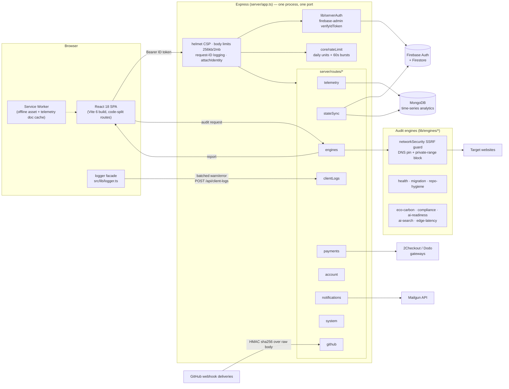

# Architecture

CatalystLab is a single-process deployable: one HTTP server hosts the Express API and the React SPA.

## Request lifecycle

1. **Transport**: `server.ts` binds `PORT`/`HOST` (env-driven, defaults `3000`/`0.0.0.0`) and mounts either Vite middleware (dev) or static `dist/` (production) behind the same Express app built by `createApp()`.
2. **Security middleware** (in order): helmet CSP — production drops `'unsafe-inline'` by allowlisting startup-computed hashes of the theme-bootstrap script; per-route JSON body limits (256 KB default, 2 MB only for state-sync bulk mutations); structured request logging with `x-request-id` (inbound IDs honored when they match a safe pattern); `attachIdentity` verifies the Firebase ID token once and attaches the server-derived identity (plan, trial, superadmin claim).
3. **Routing**: decomposed route modules register under `/api/*` (+ legacy `/stats/*`, `/telemetry/*`). An API 404 catch-all always answers JSON — the SPA fallback can never shadow an API route. A terminal error handler degrades gracefully when MongoDB is offline.
4. **Rate limiting**: engine-scan routes run `createEngineRateLimitMiddleware`, which resolves the caller's tier (visitor → free/starter/pro/team/enterprise/api_pro → superadmin) from the attached identity, charges units from the daily budget, enforces the 60-second burst window, and answers `429` with a machine-readable envelope.
5. **Engine execution**: `server/routes/engines.ts` validates the target URL, runs the SSRF guard (scheme allowlist, private-range block, DNS resolve → validate → pin the socket to that address), then dispatches to the TypeScript engine in `lib/engines/*` and returns a structured report. Redirects are never auto-followed.

## Identity and trust boundaries

- The **only** server-trusted inputs are: verified Firebase ID tokens (via `firebase-admin`), HMAC-verified webhook payloads, and the constant-time-checked `cat_live_` API-key allowlist (`VALID_API_KEYS`).
- Everything client-supplied — headers like `x-user-email`, plan strings, tier hints — is ignored for authorization. Quota/tier introspection endpoints reflect only the server-derived identity.
- Superadmin is terminal: unlimited budget (`limit: null`, `burstMax: Infinity`), granted exclusively by a signed custom claim on the verified token.

## Telemetry pipeline

First-party, ad-blocker-proof: the SPA and a tiny served script (`/api/telemetry.js`) POST events to `/api/telemetry/event` (also `/api/event`, `/stats/event`). Events are zod-validated and dropped silently when malformed, bot/prefetch traffic is filtered before any processing, geo/UA enrichment is local (`geoip-lite` + `ua-parser-js`), and events queue into MongoDB time-series collections when configured (in-memory otherwise). Query pipelines (`/api/analytics/stats`, `/api/analytics/realtime`, `/api/analytics/anomalies/check`) read the same store.

## Edge mesh (presentation layer)

The dashboard visualizes a 42-PoP edge mesh (`src/lib/edge/pops.ts`) on an interactive cobe globe (`EdgeMeshGlobe`), with plan-tier-driven PoP visibility, projection-based overlay chips, and the telemetry HUD. The mesh is a presentation/simulation feature of the product UI — engine scans execute from this single server process.

## Observability

- **Server**: pino JSON logs; per-request line with method/url/status/duration/requestId; credential headers redacted; level escalates with status (≥500 error, ≥400 warn). `LOG_LEVEL` controls verbosity.
- **Client**: `src/lib/logger.ts` — dev passthrough; production batches redacted, deduplicated warn/error events to `/api/client-logs` (schema-validated, 64 KB cap, 30 req/5 min per identity) with `sendBeacon` on pagehide. Global `error` and `unhandledrejection` hooks plus `ErrorBoundary` report through the same facade.

## Deployment notes

- Single container/process; no serverless entrypoints are load-bearing (`api/*.ts` Vercel twins are dormant; the Express server is canonical).
- `NODE_ENV=production` requires a prior `npm run build` (CSP hashing reads `dist/index.html`).
- All integrations fail closed or degrade to mock modes — a fresh deployment with zero env vars serves the full SPA and public audit surfaces safely.
